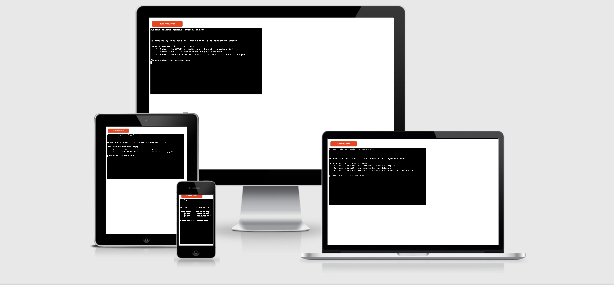
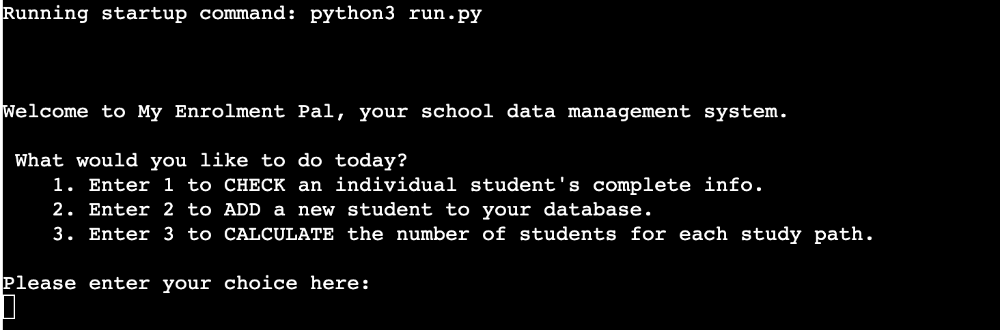
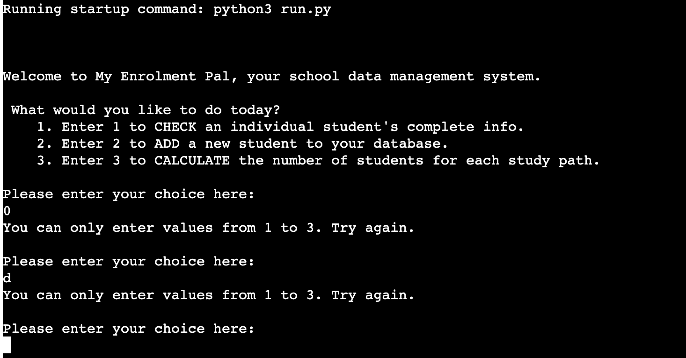
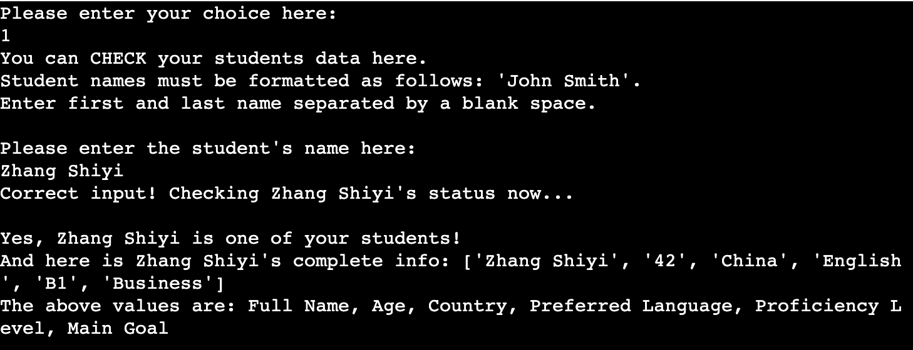
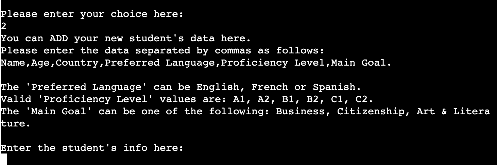
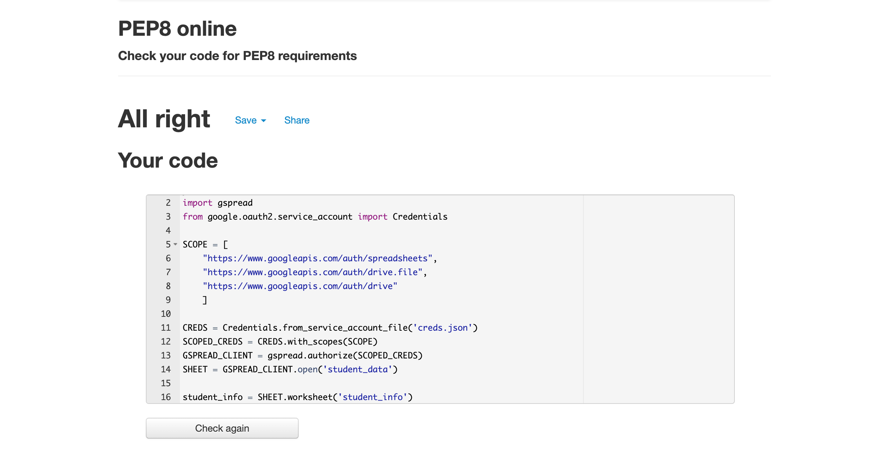
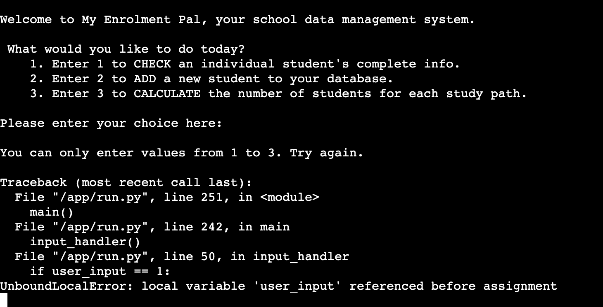
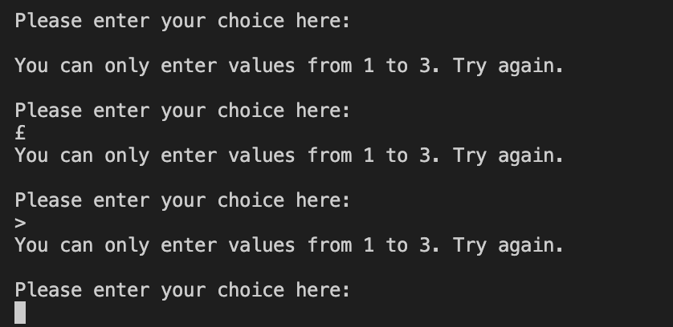

# **My Enrolment Pal**

View the live project here: https://my-enrolment-pal.herokuapp.com/.

*My Enrolment Pal* is a back-end data management program created for the educational sector.

The goal of the app is to provide an Italian language school with a tailored digital tool to handle student data.

## **1. Developer's Goals**
The developer who created the app wants to help an Italian language school manage their students' data. He has been hired to create a program that might facilitate day-to-day operations such as:   
- the checking of existing data;  
- the update of the existing database with incoming students' data;  
- the retrieval of information about the number of students for each tailored study path. 
## **2. User Goals (UX)**
The user is either the principal or a member of the staff of an Italian language school. They want a straightforward way to engage with their students' data, be it to simply check the status of enroled students or to add new ones. One important feature of this school is the offer of a curriculum tailored on the student's needs. In fact, although all students learn the same contents in the first part of the course, they can chose three different study paths during the last one. The three choices offered are Business, Citizenship and Art & Literature.  
The school management keep their data in a spreadsheet that so far has been checked and updated manually. A faster and easier tool is now desired, which will simplify the above-mentioned tasks by allowing the users to enter the needed data in a single line.

## **3. Features**
### 3.1 *Existing features*

* App Menu

Shown at the start of the program, it allows the user to 1) CHECK students' data, 2) ADD new students' data and 3) CALCULATE the number of students per curriculum.

* Initial Input Validation

Checks whether the values entered by the user are the three allowed. If not, it returns a message asking for a correct input.

* Student Not Enroled Message

 A message to notify the school management that there is no student enroled under the entered name.

 * Student Enroled Message

A message to notify the school management that the entered student is currently enroled in the school, followed by the available data for said name.

* New Student Data Addition

Allows the user to enter the data for each new student. It requires six values: Name, Age, Country, Preferred Language, Level of Proficiency, Main Goal.

* New Student Invalid Data

Returns a message to alert the user that six values are required and prompts them to enter a correct input.

* New Student Valid Data

Returns a message to notify the user that their input is correct and that the new student data has been entered into the database. From this moment on, it will be possible to verify this by using the CHECK function at the start of the program.

* No. of Students/Curriculum Calculation

This function is used when the school needs to gather specific info about the number of students for each study path. The returned number will allow the school management to allocate resources and organise courses accordingly.

* No. of Students/Business Curriculum

Returns the number of students who have chosen the Business curriculum.

* No. of Students/Citizenship Curriculum

Returns the number of students who have chosen the Citizenship curriculum.

* No. of Students/Art & Literature Curriculum

Returns the number of students who have chosen the Art & Literature curriculum.

* Next Step

An upgraded version of the initial app menu. It offers the possibility of continuing to perform other tasks or, in addition, it shows an extra option no. 4) that allows the user to CLOSE the program gracefully.

* Program Exit

An exit message that confirm the exit from the program and thanks the users for using My Enrolment Pal.

### 3.2 *Features left to implement*
* *A more thorough form of input validation for new data*
   * Within the second functionality available within the program, that is, the ADD part, it can be observed that the only type of validation currently available regards the number of required values. This can and needs to be improved by adding further checks to verify whether the input matches the data type required.
* *Additional functionality*
   * More options can be made available to the user in order to make My Enrolment Pal the main data management software of the school. One of these could be a separate part of the database dedicated to the teachers currently working for the school, which would include relevant information to be used for a proper teacher-class pairing.

## **4. Testing**
### 4.1 *Validator Testing*
* PEP8
   * The final version of the code is free of errors when passed through the PEP8 validator.

   

### 4.2 *Fixed Bugs*
* In the first funcionality of the app, an UnboundLocalError would show if special keys were pressed (such as Enter). This was fixed with the addition of an empty user_input within the input_handler function, which resets said value to an empty string. 

   

It is now possible to enter special characters (as it might happen with an incorrect user input) and see a prompt requiring values 1 to 3 alone.

   

## 5. **Deployment** 
The site has been deployed to Heroku. The steps to deploy are as follows:
   * In the 'herbalist-counter' GitHub repository, navigate to the 'Settings' page.
   * Within the 'Settings' page, open the GitHub Pages dedicated section.
   * In the 'Source' section, you can find a 'Branch' drop-down menu. Select 'main' and save the changes.
   * When the site has been successfully deployed, a message of 'Your site is published at https://...' will be displayed. (Before that, a message of 'Your site is ready to be published at https://...' will pop up during the upload.)
   * The website is now accessible through this link: https://gabriele-andolina.github.io/herbalist-counter/.

## 6. **Technologies Used**
* Languages
   * **Python 3**
* Websites and Softwares UPDATE
   * **Git**: Git was used for version control through the Gitpod terminal, to add, commit and push the project's updates to GitHub.
   * **GitHub**: GitHub, together with GitHub Pages, has been used to store the project's repository.

## 7. **Credits** 
### 7.1 *Code*
All code has been written by me personally.
### 7.2 *Inspiration*
The inspiration for this project came from the Love Sandwiches walkthrough one. Going through it has allowed me to think of a practical way to apply what I have been learning about Python. Working in a language school myself, I realised that a program similar to the Love Sandwiches app could be very useful for the staff managing the school and started thinking about the features I could include.
### 7.3 *Acknowledgments* 
This project would have never made it to completion without the guidance, help and encouragement of my mentor, Mr. Richard Wells. As a returning student, getting back into coding has come with its challenges and frustrations. However, I am truly grateful for and to Mr. Wells for constantly inspiring and showing me how to improve, both in terms of technical skills and personal approach to coding. Even though we've known each other for slightly more than a month now, his help is truly invaluable.

