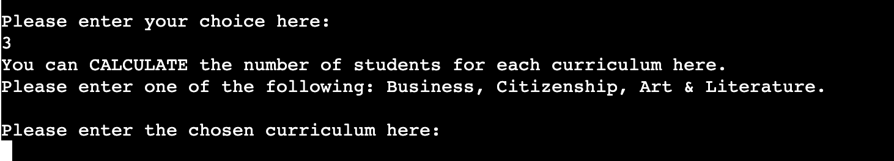

# **My Enrolment Pal**

View the live project here: https://my-enrolment-pal.herokuapp.com/.

*My Enrolment Pal* is a back-end data management program created for the educational sector.

The goal of the app is to provide an Italian language school with a tailored digital tool to handle student data.

## **1. Developer's Goals**
The developer who created the app wants to help an Italian language school manage their students' data. He has been hired to create a program that might facilitate day-to-day operations such as:   
- the checking of data;  
- the update of the existing database with incoming students' data;  
- the retrieval of information about the number of students for each tailored study path. 
## **2. User Goals (UX)**
The user is either the principal or a member of the staff of an Italian language school. They want a straightforward way to engage with their students' data, be it to simply check the status of enroled students or to add new ones. One important feature of this school is the offer of a curriculum tailored on the student's needs. In fact, although all students learn the same contents in the first part of the course, they can chose three different study paths during the last portion of their studies. The three choices offered are Business, Citizenship and Art & Literature.  
The school management keep their data in a spreadsheet that so far has been checked and updated manually. A faster and easier tool is now desired, which will simplify the above-mentioned tasks by allowing the users to enter the needed data in a single line.

## **3. Features**
### 3.1 *Existing features*

* App Menu

Shown at the start of the program, it allows the user to 1) CHECK students' data, 2) ADD new students' data and 3) CALCULATE the number of students per curriculum.

* Initial Input Validation

Checks whether the values entered by the user are the three allowed. If not, it returns a message asking for a correct input.

* Student Not Enroled Message

 A message to notify the school management that there is no student enroled under the entered name.

 * Student Enroled Message

A message to notify the school management that the entered student is currently enroled in the school, followed by the available data for said name.

* New Student Data Addition

Allows the user to enter the data for each new student. It requires six values: Name, Age, Country, Preferred Language, Level of Proficiency, Main Goal.

* New Student Invalid Data

Returns a message to alert the user that six values are required and prompts them to enter a correct input.

* New Student Valid Data

Returns a message to notify the user that their input is correct and that the new student data has been entered into the database. From this moment on, it will be possible to verify this by using the CHECK function at the start of the program.

* No. of Students/Curriculum Calculation

This function is used when the school needs to gather specific info about the number of students for each study path. The returned number will allow the school management to allocate resources and organise courses accordingly.

* No. of Students/Business Curriculum

Returns the number of students who have chosen the Business curriculum.

* No. of Students/Citizenship Curriculum

Returns the number of students who have chosen the Citizenship curriculum.

* No. of Students/Art & Literature Curriculum

Returns the number of students who have chosen the Art & Literature curriculum.

* Next Step

An upgraded version of the initial app menu. It offers the possibility of continuing to perform other tasks or, in addition, it shows an extra option no. 4) that allows the user to CLOSE the program gracefully.

* Program Exit

An exit message that confirm the exit from the program and thanks the users for using My Enrolment Pal.

### 3.2 *Features left to implement*
* *Something else*
   * 
* *Something else*
   * An additional page could host separate informative sheets about herbs, each one describing some important qualities of each herb, as well as some interesting anecdote or historical fact. This feature will expand the educational mission of the two herbalists.

## **4. Testing**
### 4.1 *Validator Testing*
* PEP8
   * The final version of the code is free of errors when passed through the official [W3C Validator](https://validator.w3.org/nu/?doc=https%3A%2F%2Fgabriele-andolina.github.io%2Fherbalist-counter%2F).
   UPDATE

   

### 4.7 *Testing User Stories*
* First-time user:
   * UPDATE
* Returning user:
   * UPDATE

## 5. **Deployment** UPDATE
The site has been deployed to GitHub Pages. The steps to deploy are as follows:
   * In the 'herbalist-counter' GitHub repository, navigate to the 'Settings' page.
   * Within the 'Settings' page, open the GitHub Pages dedicated section.
   * In the 'Source' section, you can find a 'Branch' drop-down menu. Select 'main' and save the changes.
   * When the site has been successfully deployed, a message of 'Your site is published at https://...' will be displayed. (Before that, a message of 'Your site is ready to be published at https://...' will pop up during the upload.)
   * The website is now accessible through this link: https://gabriele-andolina.github.io/herbalist-counter/.

## 6. **Technologies Used**
* Languages
   * **Python 3**
* Websites and Softwares UPDATE
   * **Balsamiq**: used to create the website's wireframes (located in the 'documentation' folder)
   * **Font Awesome**: FA's icons were used to create the social media links found in the website's footer.
   * **Git**: Git was used for version control through the Gitpod terminal, to add, commit and push the project's updates to GitHub.
   * **GitHub**: GitHub, together with GitHub Pages, has been used to store the project's repository and deploy the website.
   * **Google Fonts**: Google Fonts has been used to import the two fonts in use on the website, namely the "Great Vibes" and "Montserrat" ones.
   * **Compresss.com**: This website has been instrumental in reducing the size of the images employed in the project, with the positive result of an increased performance in the final version.
   * **ColorSpace**: The color palette used in the project has been created on this website.

## 7. **Credits** UPDATE
### 7.1 *Code*
All code (with the exception of the "Where to find us" section's iframe, credited below) has been personally written, however I referred to the documentation throughout the entire development process.
### 7.2 *Inspiration*
Some online resources have been very helpful in the code-writing process. Among these is the 'Love Running Walkthrough Project', which has proven beneficial to lay down a sequential path for the development of a website. I have also availed myself of additional online resources such as Stack Overflow and CSS-tricks.com, albeit never copying code.
### 7.3 *IFrame*
The IFrame within the 'Where to find us' section has been created and imported from the Google Maps Platform (within the Google Cloud Platform and accessible here: https://cloud.google.com/)
### 7.4 *Content*
The entirety of the content found on the website has been created by me personally. The specific herbal mixtures written of in the 'Herbs' section ('Our products' page) come from a tiny booklet with some herbal tea suggestions given to me by the herbalist I usually visit for my herbal purchases.
### 7.5 *Media*
All the images displayed on the website have been downloaded from Unsplash.com. Here follows the list of the photographers whose work has made this project possible:
   * *Hero image* by Swapnll Dwivedi 
   * *Our story* photo by Peter Conlan
   * *The Counter* photo by Matt Briney 
   * *Our Philosophy* photo by NeONBRAND
   * *Herbs* photo by Katherine Hanlon
   * *Tea* photo by Desi Dermz. 
   * *Soaps and perfumes* photo by Paul Gaudriault 
   * *Herbal Friday* photo by Annie Spratt 
   * *Tea ceremony* photo by 五玄土
   * *Where to find us* photo by Mike Petrucci
   * *Get in touch* photo by Stanley Dai
   * *Thank you* photo by Towfiqu barbhuiya
### 7.6 *Acknowledgments* UPDATE
A special thank you to my mentor, Mr. Can Sucullu, who has greatly helped me and wisely instructed me throughout the entire project.

